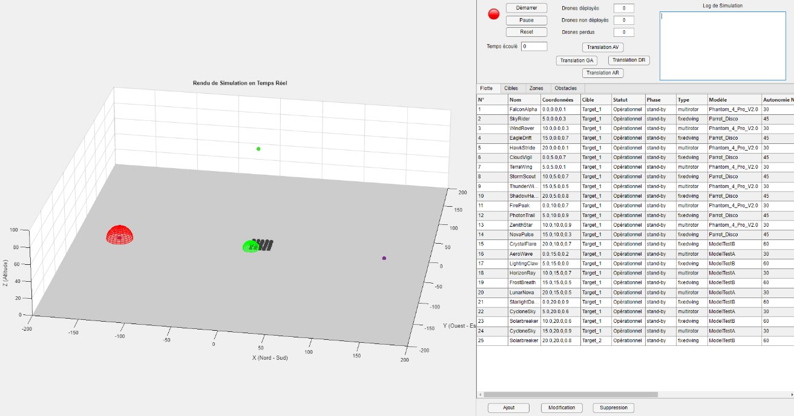
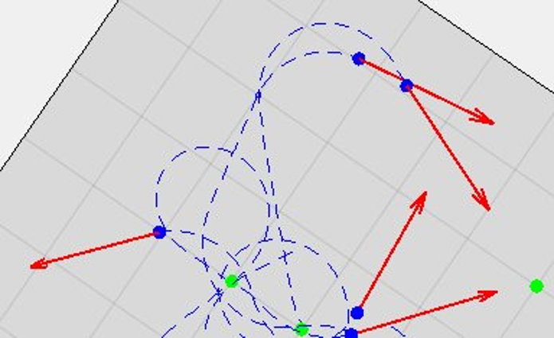

# Simulation and control of a drone swarm on Matlab

This project was made by a team of 6 students at ESTACA (École Supérieure des Techniques Aéronautiques et de Construction Automobile) engineering school during school year 2024-2025.
It aims to simulate and control a collaborative drone swarm using MATLAB, drawing inspiration from fish schools. The simulation incorporates aspects such as drone physical caracteristics, behavioral laws, obstacle avoidance, etc.
The project was carried out at ESTACA, in partnership with Safran.

# Problem statement 

The goal is to coordinate a set of drones to autonomously and collaboratively complete complex missions.

# Specifications

The simulated drones are aerial (flying) with:
- Fixed-wing (airplanes) or rotary-wing (quadcopters, VTOL).
- Limited flight autonomy, type-dependent (variable performance in speed, endurance).
- Trajectory piloting via velocity vector; each drone knows its state (position, velocity).
- Scalable swarm (>20 drones, mixed types).
- Distance-based observation (triangulation for accuracy).

# Simulation settings

# Behavioral laws

The swarm behaviour is modeled based on natural swarms

# User interface (UI)

The program includes a MATLAB interface for real-time visualization, allowing to control and monitor the simulation ;
After specifying the settings of the simulation, the user can start/pause or reset the simulation, and see informations about each drone, obstacles, targets, important messages (like a collision between drones), etc.

# Display

Here is a glimpse of the simulation:

view at the start of the simulation with UI :

view of the movement of drones during simulation :

# Installation and usage (in French)

étapes pour setup le projet:  
    installer git: https://git-scm.com/  
    dans un terminal:  
        git config --global user.name "Ton Nom"  
        git config --global user.email "ton-email@example.com"  
     git clone https://github.com/Drovulook/ESTACA-projet-essaim-drones-2024-2025 (dans le répertoire voulu)  

enregistrer les modifications sur git:  
    git add .  
    git commit -m "description des modifs"  
    git push origin main (on fait tout sur la même branche, pour l'instant ?)  

récupérer les dernières modifications enregistrées sur github:  
    git pull origin main
